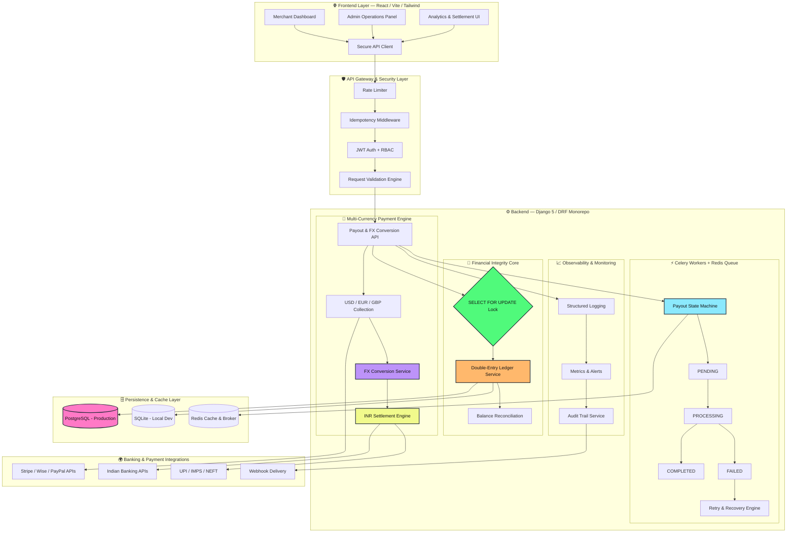

# 💸 Playto Payout Engine

[](https://www.djangoproject.com/)
[](https://reactjs.org/)
[](https://www.postgresql.org/)
[](https://docs.celeryq.dev/)

A high-performance monorepo designed for Indian merchants to collect international payments in **USD** and withdraw locally in **INR**. Built with a focus on strict financial integrity, including ledger atomicity, concurrency locks, and request idempotency.


---

### 🎥 Live Project Demo

<video src="https://github.com/user-attachments/assets/d49422a7-51c5-4b5f-9ba2-59f9230080e5" controls="controls" style="max-width: 100%; height: auto;">
</video>

---
---
### 🏗️ System Architecture

---
## 🚀 Core Features

- **Ledger-Based Accounting:** Double-entry-inspired ledger for precise balance tracking.
- **Atomic Transactions:** Prevents double-spending using database-level `SELECT FOR UPDATE` locks.
- **Idempotency:** Custom middleware ensuring duplicate API requests don't result in duplicate payouts.
- **Asynchronous Processing:** Celery-driven state machine for payout lifecycle management.
- **Modern Dashboard:** Clean React + Tailwind UI for merchant operations.

---

## 🛠 Tech Stack

| Layer | Technology |
| :--- | :--- |
| **Backend** | Django, Django REST Framework (DRF) |
| **Frontend** | React, Vite, Tailwind CSS |
| **Database** | PostgreSQL (Production) / SQLite (Local Dev) |
| **Task Queue** | Celery + Redis |
| **Infrastructure** | Docker, Docker Compose |

---

## 📦 Quick Start (Docker)

The fastest way to get the engine running:

```bash
# 1. Clone and launch
docker compose up --build

# 2. Seed data & generate auth tokens (In a new terminal)
docker compose exec web python manage.py seed_data

## 🔧 Manual Setup (No Docker)

### 1️⃣ Prerequisites

* Python 3.11+ & Node 20+
* Redis (running locally on port 6379)

---

### 2️⃣ Backend Setup

```bash
cd backend
python -m venv .venv
# Windows: .\.venv\Scripts\activate | Unix: source .venv/bin/activate
pip install -r requirements.txt
python manage.py migrate
python manage.py seed_data
python manage.py runserver
```

---

### 3️⃣ Workers & Beats

```bash
# In separate terminal tabs
celery -A celeryconfig worker -l info
celery -A celeryconfig beat -l info
```

---

### 4️⃣ Frontend Setup

```bash
cd frontend
npm install
# Set API location
set VITE_API_BASE=http://127.0.0.1:8000
npm run dev
```

---

## 🧪 Testing Concurrency & Idempotency

```bash
# Set test environment
export API=http://127.0.0.1:8000
export T=YOUR_TOKEN_HERE

# Fire two simultaneous 60.00 INR requests
curl -s -o /dev/null -w "%{http_code}\n" -X POST "$API/api/v1/payouts/" \
  -H "Authorization: Token $T" -H "Content-Type: application/json" \
  -H "Idempotency-Key: key-1" -d '{"amount_paise":6000,"bank_account_id":"HDFC_1"}' &

curl -s -o /dev/null -w "%{http_code}\n" -X POST "$API/api/v1/payouts/" \
  -H "Authorization: Token $T" -H "Content-Type: application/json" \
  -H "Idempotency-Key: key-2" -d '{"amount_paise":6000,"bank_account_id":"HDFC_1"}' &
wait
```

**Expected:** One `201 Created` and one `400 Bad Request` (Insufficient Balance)

---

## 📂 Project Structure

```
├── backend/
│   ├── config/          # Project settings & URL routing
│   ├── merchants/       # Merchant profiles & auth
│   ├── ledger/          # Financial logging & balance logic
│   ├── payouts/         # Payout state machine & DRF Views
│   ├── idempotency/     # Request deduplication logic
│   └── tests/           # Concurrency & logic test suites
├── frontend/
│   ├── src/             # React components & hooks
│   └── public/          # Static assets
└── docker-compose.yml   # Multi-container orchestration
```

---

## 📋 Environment Variables (Backend)

| Key               | Default                  | Note                                      |
| ----------------- | ------------------------ | ----------------------------------------- |
| DJANGO_DEBUG      | 1                        | Set to 0 for production                   |
| SQLITE_DEBUG      | 0                        | Set to 1 to bypass Postgres for local dev |
| CELERY_BROKER_URL | redis://localhost:6379/0 | Path to Redis                             |

---

## 📖 Explainer

For a deep dive into the architecture (ledger queries, database locking strategies, and payout states), refer to **EXPLAINER.md**

